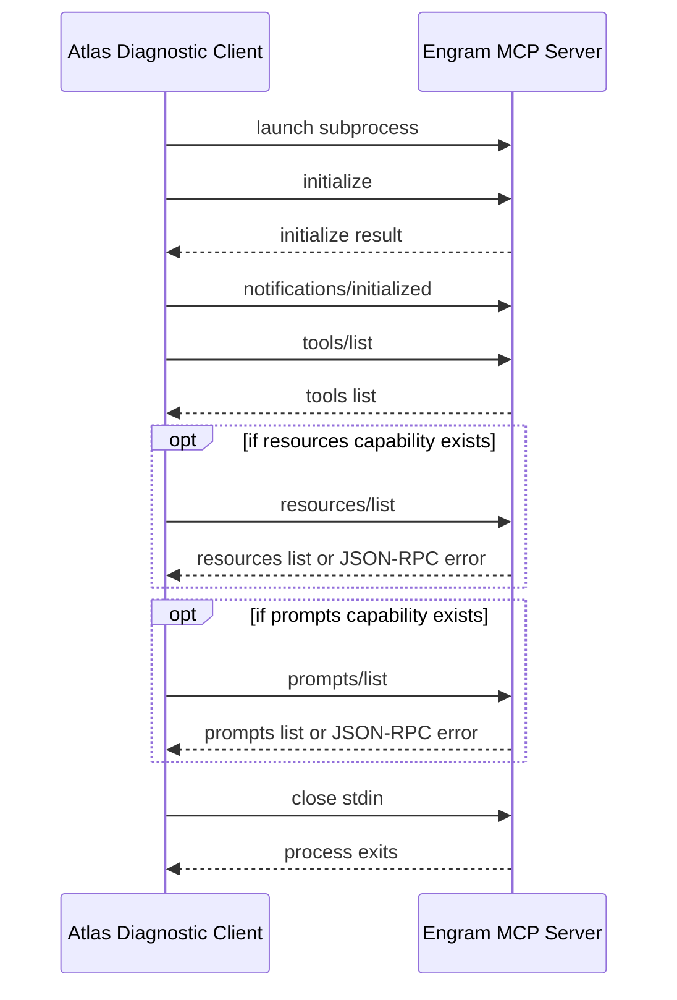

# MCP Protocol Validation V1

## Executive Summary

Codex-Atlas V4.3 validates the MCP base protocol with a generic stdio diagnostic client. This is not an Engram integration and does not call any Engram tools.

Evidence:

- initialize: PASS
- notifications/initialized: PASS
- tools/list: PASS
- resources/list: NOT_SUPPORTED by Engram capability negotiation
- prompts/list: NOT_SUPPORTED by Engram capability negotiation
- shutdown by closing stdin and waiting: PASS
- tools detected from Engram MCP: 18
- tools/call: not executed
- memory read/write: not executed
- global Codex/Claude config: untouched

Classification: MCP_PROTOCOL_VALIDATED.

Official sources:

- https://modelcontextprotocol.io/specification/2025-06-18/basic/lifecycle
- https://modelcontextprotocol.io/specification/2025-06-18/basic/transports
- https://modelcontextprotocol.io/specification/2025-06-18/server/tools
- https://modelcontextprotocol.io/specification/2025-06-18/server/resources
- https://modelcontextprotocol.io/specification/2025-06-18/server/prompts
- https://modelcontextprotocol.io/specification/2025-06-18/basic/utilities/ping
- https://modelcontextprotocol.io/specification/2025-06-18/basic/utilities/cancellation
- https://github.com/Gentleman-Programming/engram

## MCP Lifecycle

The MCP lifecycle has three phases:

1. Initialization: version, capabilities and implementation metadata are negotiated.
2. Operation: client and server exchange requests, responses and notifications allowed by negotiated capabilities.
3. Shutdown: the underlying transport is closed.

For stdio, the official transport model is:

- client launches the server as a subprocess,
- client writes JSON-RPC messages to server stdin,
- server writes JSON-RPC messages to stdout,
- messages are UTF-8 JSON-RPC objects delimited by newlines,
- messages must not contain embedded newlines,
- stderr is only logging,
- stdout must contain only valid MCP messages.

## Messages

### initialize

Client request:

```json
{
  "jsonrpc": "2.0",
  "id": 1,
  "method": "initialize",
  "params": {
    "protocolVersion": "2025-06-18",
    "capabilities": {},
    "clientInfo": {
      "name": "codex-atlas-mcp-diagnostic-client",
      "title": "Codex-Atlas MCP Diagnostic Client",
      "version": "v1"
    }
  }
}
```

Engram response summary:

```json
{
  "jsonrpc": "2.0",
  "id": 1,
  "result": {
    "protocolVersion": "2025-06-18",
    "capabilities": {
      "tools": {
        "listChanged": true
      }
    },
    "serverInfo": {
      "name": "engram",
      "version": "0.1.0"
    }
  }
}
```

### initialized

After receiving a successful initialize response, the client sends a notification:

```json
{
  "jsonrpc": "2.0",
  "method": "notifications/initialized"
}
```

### tools/list

Client request:

```json
{
  "jsonrpc": "2.0",
  "id": 2,
  "method": "tools/list",
  "params": {}
}
```

Engram response: PASS, 18 tools returned.

### tools/call

Not executed in V4.3. The adapter must not call tools until Atlas has a separate policy for tool permissioning, memory writes and evidence capture.

### resources/list and resources/read

`resources/list` is now implemented as optional discovery in the diagnostic adapter. The client only sends it when the server advertises the `resources` capability. If capability negotiation omits resources, or the server responds with JSON-RPC `-32601 Method not found`, Atlas records `NOT_SUPPORTED` and keeps the main protocol validation intact.

Observed Engram result in V4 Integration Layer: `NOT_SUPPORTED`; Engram advertised only `tools` in `initialize`.

`resources/read` remains out of scope. No resource content is read.

### prompts/list and prompts/get

`prompts/list` is now implemented as optional discovery in the diagnostic adapter. The client only sends it when the server advertises the `prompts` capability. If capability negotiation omits prompts, or the server responds with JSON-RPC `-32601 Method not found`, Atlas records `NOT_SUPPORTED` and keeps the main protocol validation intact.

Observed Engram result in V4 Integration Layer: `NOT_SUPPORTED`; Engram advertised only `tools` in `initialize`.

`prompts/get` remains out of scope. No prompt content is requested.

### notifications

Notifications are JSON-RPC messages without an id. V4.3 sends only notifications/initialized. No server notifications were observed.

### errors

MCP uses JSON-RPC error responses. The client treats error responses for initialize or tools/list as validation failure. No errors were observed.

### shutdown

For stdio, shutdown is transport-level. The V4.3 client closes stdin and waits for the server process to exit, matching the official lifecycle guidance. Engram exited with code 0.

## Diagram



## Atlas Current State

Atlas had advisory MCP profiles, Engram CLI sandbox proof and MCP process startup proof. It did not previously have an executable MCP client lifecycle.

V4.3 added:

- tools/mcp_stdio_diagnostic_client.py
- tests/test_mcp_stdio_diagnostic_client.py

The V4 Integration Layer extends the same generic adapter with optional `resources/list` and `prompts/list` discovery. These checks are capability-aware and do not turn unsupported server surfaces into failures.

This is a diagnostic adapter only. It is not connected to Planner, Runtime, Evidence, Dashboard or Failure Registry.

## Engram Tools Detected

| Tool | Type | Parameters | Purpose |
|---|---|---|---|
| mem_capture_passive | object | content, session_id, source | Extract structured learnings from text. |
| mem_compare | object | confidence, memory_id_a, memory_id_b, model, reasoning, relation | Persist a semantic relation verdict. |
| mem_context | object | project, scope | Retrieve recent memory context. |
| mem_current_project | object | none | Detect current project. |
| mem_doctor | object | check, project | Run read-only diagnostics. |
| mem_get_observation | object | id | Fetch one full observation by ID. |
| mem_judge | object | confidence, evidence, judgment_id, reason, relation, session_id | Resolve a pending memory conflict. |
| mem_pin | object | id | Pin a local observation. |
| mem_review | object | action, id, limit, observation_id, project | Review stale observation lifecycle state. |
| mem_save | object | capture_prompt, content, observation, project, project_choice_reason, recovery_token, scope, session_id, title, topic_key, type | Save a structured memory observation. |
| mem_save_prompt | object | content, project, project_choice_reason, recovery_token, session_id | Save a user prompt. |
| mem_search | object | all_projects, limit, project, query, scope, type | Search memory. |
| mem_session_end | object | id, summary | End a coding session. |
| mem_session_start | object | directory, id | Start a coding session. |
| mem_session_summary | object | content, session_id | Save end-of-session summary. |
| mem_suggest_topic_key | object | content, title, type | Suggest stable topic key. |
| mem_unpin | object | id | Unpin a local observation. |
| mem_update | object | content, id, scope, title, topic_key, type | Update an observation. |

No tool was called.

## Atlas Future

A future adapter can add resources/read, prompts/get, tools/call, request cancellation, ping, pagination, richer capability-aware gating, timeout policy and structured audit records. `tools/call` is explicitly excluded from the current phase and should first be tested only against read-only sandbox tools.

## Adapter Proposed

The proposed Atlas MCP adapter should stay layered:

```text
MCPStdioTransport
  -> JSONRPCClient
  -> MCPInitializeClient
  -> CapabilityRegistry
  -> ToolCatalog
  -> PolicyGate
  -> Runtime-specific caller
```

V4.3 implements only the first four diagnostic pieces needed to prove protocol understanding. Tool execution must remain behind a later policy gate.

## Compatibility

| MCP | Classification | Notes |
|---|---|---|
| GitHub MCP | COMPATIBLE_CON_ADAPTER | Same initialize/list/call lifecycle, but needs auth and write gating. |
| Notion MCP | COMPATIBLE_CON_ADAPTER | Needs OAuth/privacy policy and page-level boundaries. |
| Context7 | COMPATIBLE | Mostly read-oriented docs context if exposed as MCP tools/resources. |
| Playwright | REQUIERE_CAPAS_EXTRA | Browser lifecycle, timeouts, screenshots and side effects need extra controls. |
| Magic/21st | REQUIERE_CAPAS_EXTRA | Secret and generated UI/derivative risk need policy layers. |
| Filesystem | REQUIERE_CAPAS_EXTRA | Requires path allowlists and write restrictions. |
| Vercel | REQUIERE_CAPAS_EXTRA | Deploy/write risks require dry-run and approval layers. |
| Google Drive | COMPATIBLE_CON_ADAPTER | Needs document privacy, OAuth and read/write separation. |
| Slack | REQUIERE_CAPAS_EXTRA | Sending messages is side-effectful; needs strict send block. |
| Telegram | REQUIERE_CAPAS_EXTRA | Bot token and message-send risks need policy layers. |
| Supabase | REQUIERE_CAPAS_EXTRA | Query permissions, data privacy and destructive SQL controls required. |

## Risks

- A valid protocol cycle does not make any tool safe to call.
- Tool descriptions may contain prompt-injection content.
- A server can expose write-capable or destructive tools through tools/list.
- Some MCPs require OAuth or tokens not visible to the generic adapter.
- stdio subprocesses can hang if timeouts are missing.
- Future HTTP transport support needs additional security controls.

## Roadmap

1. Keep V4.3 diagnostic client separate from runtime.
2. Keep capability-aware resources/list and prompts/list diagnostics as discovery-only checks.
3. Add tool-catalog risk classification without calling tools.
4. Add a sandbox-only tools/call test for a read-only tool such as mem_current_project or mem_doctor.
5. Add permission gates before any memory-writing tool.
6. Only after those gates, consider Engram-specific integration.

## Decision

MCP Protocol: VALIDATED for lifecycle plus discovery of `tools/list`, with optional `resources/list` and `prompts/list` recorded as `PASS` or `NOT_SUPPORTED` according to negotiated capabilities.

Engram integration: not declared.

Engram tool execution: not attempted.
